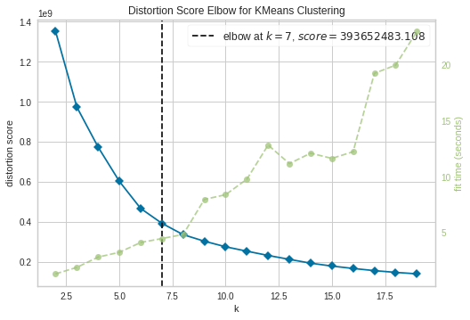
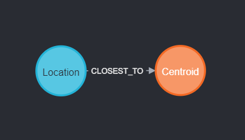
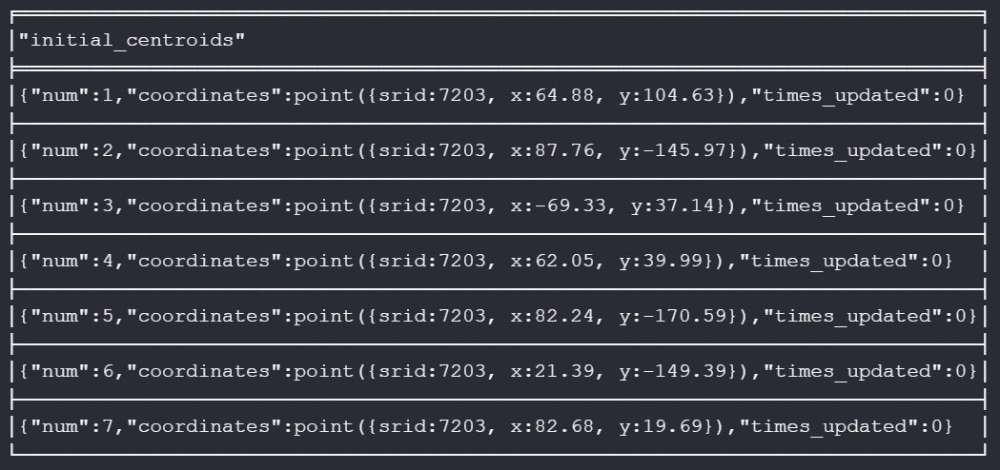
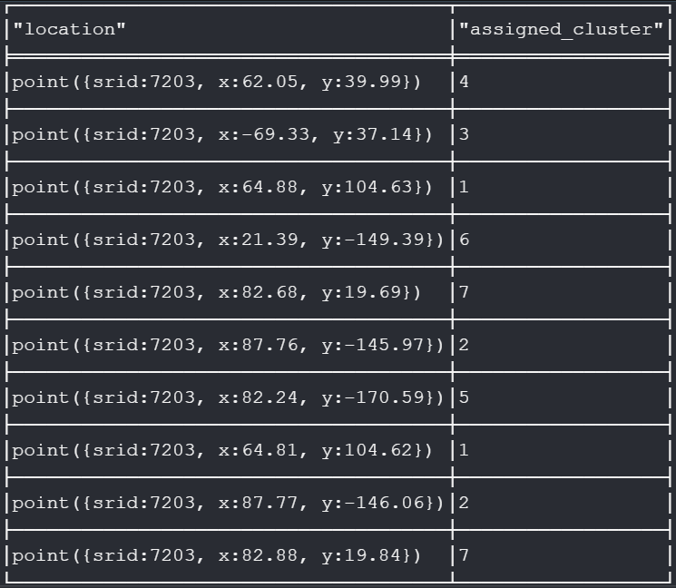
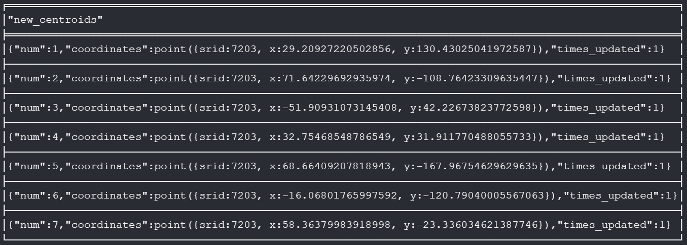
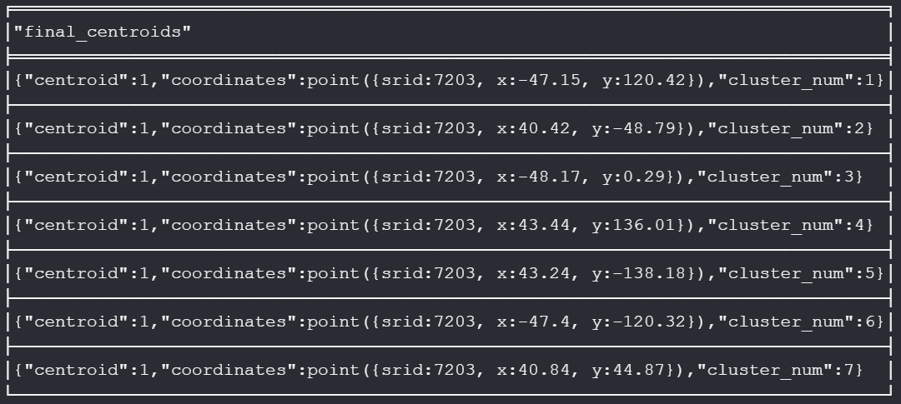
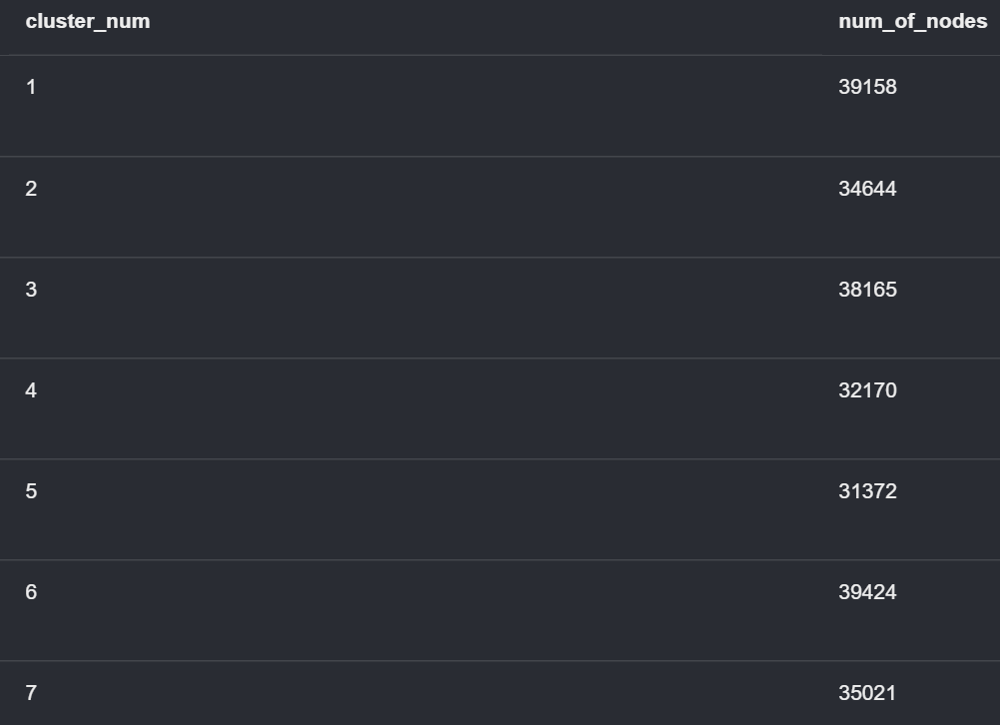
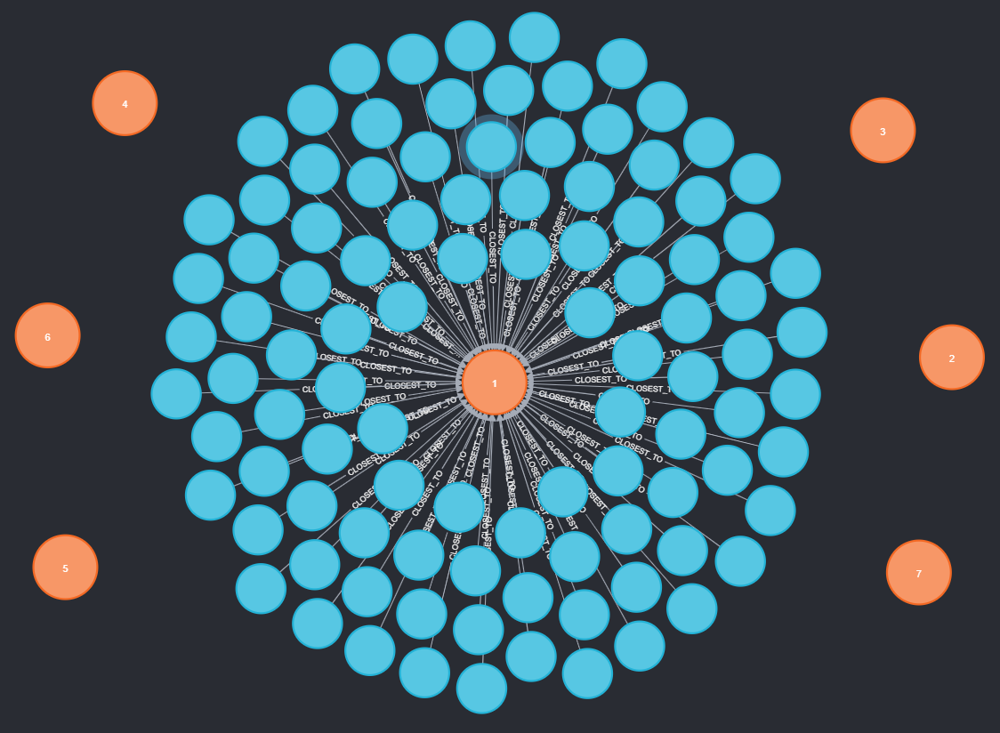
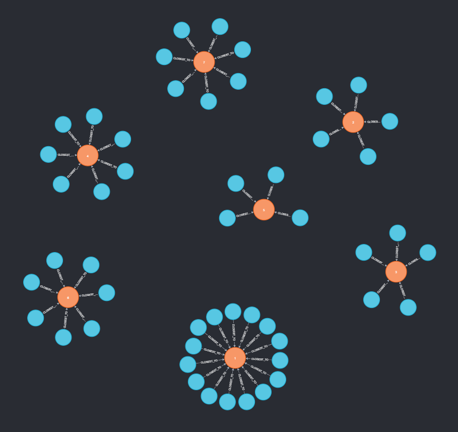
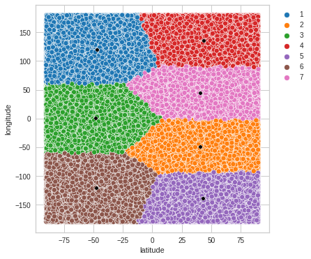

<h2>Clustering Geospatial Data using Cypher and Neo4j</h2>  

<h3>Dataset:</h3>

The given dataset consists of 2,50,000 rows of geospatial data (latitudes and longitudes).    

<h3>Algorithm Used:</h3> 

In order to cluster the data, I have used the <b>KMeans Clustering</b> algorithm. <b>Elbow Method</b> has been used to determine the optimal value of <i>k</i> or the number of clusters. It works by calculates the WCSS (sum of sqaured distances between each point and centroid in a cluster) and returns the value of <i>k</i> at which an 'elbow' is observed in the graph and it starts to become parallel to the X-axis. Using this method, the optimal value of <b><i>k</i> = 7</b>.  

<figure>
  
</figure>  

<h3>Approach Used:</h3>

I have implemented KMeans using <b>Neo4j and Cypher</b> using a graph-based approach. Every row in the dataset is representated by a <b>'Location'</b> node consisting of the following properties:   

*   coordinates: A point which stores the latitude (x) and longitude (y) of this location
*   cluster_num: To store the cluster to which this location belongs
*   centroid: To store whether or not this location is a centroid (initially all locations are assigned 0)   
 
<i>k</i> <b>'Centroid'</b> nodes are also created to keep track of cluster centers and have the following properties:  

*   coordinates: A point which stores the latitude (x) and longitude (y) of this centroid
*   num: To uniquely identify this centroid and its associated cluster
*   times_updated: To keep track of how many times the coordinates of this centroid are updated  

Each 'Location' node has a directed edge or outgoing relationship <b>'CLOSEST_TO'</b> with the 'Centroid' of the cluster that it belongs to. At any point in time, a 'Location' node must have <b>exactly one</b> outgoing relationship to any one 'Centroid'.   

<h3>Database Schema:</h3>  
<figure>
  
</figure>  

<h3>Clustering:</h3>

I adapted the KMeans algorithm to a graph based approach in the following way:  

1.   Read the data and create a 'Location' node for each row with respective coordinate values and cluster_num and centroid initialised to 0. Round off the latitutde and longitude values to 2 decimal places to avoid overly precise calculations. 
2.   Find and delete duplicate 'Location' nodes that may arise due to rounding off. 
3.   Create <i>k</i> 'Centroid' nodes with coordinate values assigned randomly by picking the coordinates of any <i>k</i> unique 'Location' nodes. Assign each 'Centroid' a num between 1 and <i>k</i> and set times_updated to 0. 
4.   Assign each 'Location' to its nearest cluster by calculating the geodesic distance between the point and each 'Centroid'. Create an outgoing 'CLOSEST_TO' relation between the point and the closest cluster center.
5.   Recalculate the coordinates of the 'Centroid' nodes to be the mean latitude and longitude of all 'Location' nodes within that cluster and increment times_updated by 1. 
6.   Run the loop for KMeans by repeating Steps 4-5 until there are no changes in the clusters or a max number of iterations is reached. Instead of creating a relationship as in Step 4, within the loop we change the relationship to end at the new cluster center to maintain the constraint of exactly one outgoing relationship with any 'Centroid' at a time. 
7.   Assign the final centroids to be <i>k</i> actual locations from the dataset by finding the closest 'Location' point to each 'Centroid'. Set centroid to 1 for each such chosen 'Location'.    

<h3>Neo4j Screenshots:</h3>

<figure>
  <figcaption>Initial Centroids:</figcaption>    
  
</figure>

<figure>
  <figcaption>Assigned Clusters:</figcaption>    
  
</figure>

<figure>
  <figcaption>New Centroids:</figcaption>    
  
</figure>

<figure>
  <figcaption>Final Centroids:</figcaption>    
  
</figure>

<figure>
  <figcaption>Cluster Sizes:</figcaption>    
  
</figure>

<figure>
  <figcaption>Single Cluster:</figcaption>    
  
</figure>

<figure>
  <figcaption>50 Random Locations with Relations:</figcaption>    
  
</figure>  

<h3>Final Output Visualization:</h3>
<figure>
  
</figure>  

For the purposes of comparison, I also visualised the output for varying values of <i>k</i> keeping all other methods and parameters constant. These can be seen in the ipynb uploaded.    

<h3>Code and Files:</h3>

1.   The input CSV file 'lat_long.csv' has been uploaded and consists of two columns -- latitude and longitude.  
2.   All Cypher code has been uploaded as a text file named 'cypher_code.txt'.  
3.   Python code for EDA, Elbow Method and to generate output visualizations has been uploaded in the notebook 'DataX2_Assignment1_SehajpreetKaur.ipynb'.  
4.   The output CSV file for <i>k</i>=7 'output.csv' generated at the end of clustering in Neo4j has been uploaded and consists of four columns -- latitude, longitude, cluster_number and centroid.  
5.   All images have been uploaded into the screenshots folder.    

<h3>References:</h3>

1.   https://medium.com/neo4j/k-means-clustering-with-neo4j-b0ec54bf0103
